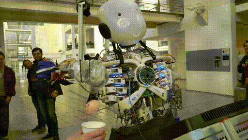

# Robotics Workshop Arm AIoT Dev Summit 2019

This repository contains all the steps needed to set up and follow our Workshop for Arm AIoT Dev Summit 2019. All the code used in our workshop will be added here, as well as the general instructions we are following.

## Overview

The content for this workshop will show you how to create an offline voice assistant using the MATRIX Creator and [Snips.ai](https://snips.ai). In the interest of time, all of the required packages and code are available on the pre-flashed image provided in the workshop kit.

## Guides:

- ### [Pre-Workshop Setup](workshop_pre_reqs.md)

- ### [What is This Workshop About?](introduction.md)

- ### [Get Started](get_started.md)

- ### [Create a Snips Assistant](snips_assistant.md)

- ### [Code Actions from Voice Commands](voice_to_actions.md)

- ### [Bonus Challenge](im_bored_challenge.md)

## Resources:
- ### [Arm AIoT Website](https://armsummit.bemyapp.com/)
- ### [Workshop Image]()
- ### [MATRIX Documentation](https://docs.matrix.one)
- ### [MATRIX Community](https://community.matrix.one)
- ### [Snips.ai Website](https://snips.ai/)