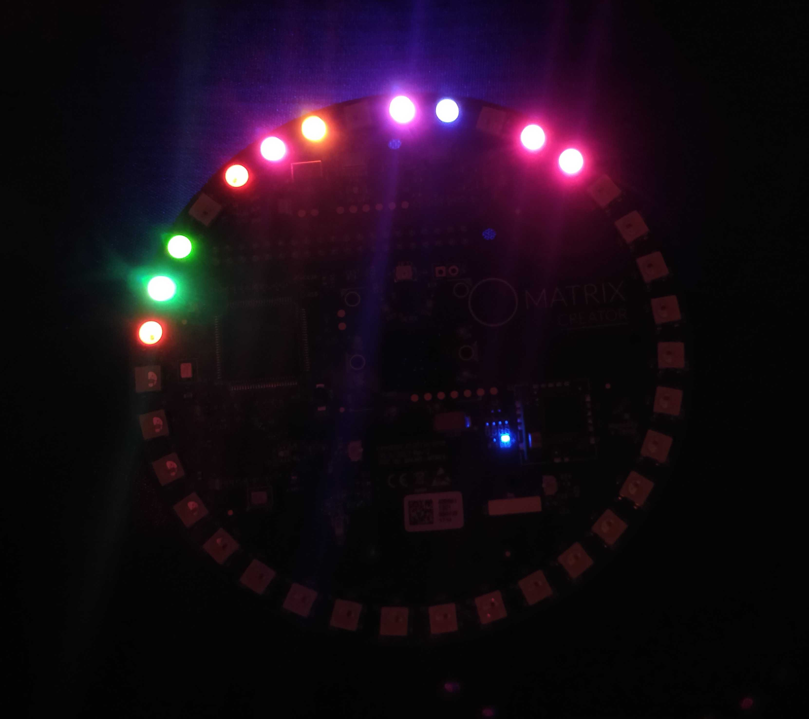
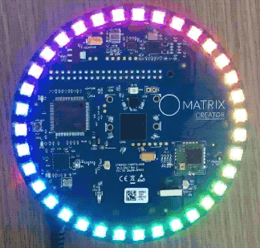

# Get Started

## Enter your Pi
- Take note of the number written on your microSD card. The hostname of your Pi will be MATRIX followed by that number. *For example, the number 27 on the microSD indicates a hostname of MATRIX27*

- Insert the microSD card provided into the microSD card slot on your Raspberry Pi 3B.

- Power the Raspberry Pi with the 5V 2.5A power supply


- Wait until some of the LEDs on your MATRIX Creator light up


The colors of the LEDs represent your Pi's IP following [this key](https://gist.github.com/samreenislam/225ea47cc30d202758b5a2195285fead).

SSH into your Raspberry Pi using the following command in your computer's terminal
```
ssh pi@YOUR_PI_HOSTNAME.local
```
or
```
ssh pi@YOUR_PI_IP
```

***
## Dive into MATRIX Lite JS
This workshop will employ MATRIX Lite JS to easily access and employ sensor data, set LEDs, GPIOs, and read/write to NFC tags.

Enter into the `/home/pi/matrix_lite` directory.

## LEDs



Open the `leds.js` file. Code below.
<details close>
<summary>
leds.js : LED API for MATRIX Lite JS
</summary>

```js
var matrix = require("@matrix-io/matrix-lite");

// Get LED count
console.log("This device has " + matrix.led.length + ' LEDs');

// A single string or object sets all LEDs
// Below are different ways of expressing a color (number values are from 0-255)
matrix.led.set('blue');
matrix.led.set('rgb(0,0,255)');
matrix.led.set('#0000ff');
matrix.led.set({r:0, g:0, b:255, w:0}); // objects can set white

// LEDs off
matrix.led.set('black');
matrix.led.set([]);
matrix.led.set();
matrix.led.set({});

// Arrays set individual LEDs
matrix.led.set(['red', 'gold', 'purple', {}, 'black', '#6F41C1', 'blue', {g:255}]);

// Arrays can simulate motion
everloop = new Array(matrix.led.length).fill({});
everloop[0] = {b:100};

setInterval(function(){
  var lastColor = everloop.shift();
  everloop.push(lastColor);
  matrix.led.set(everloop);
},50);
```
</details>

Play with the code to make different LED animations.
- Make the LEDs purple
- Loop 2 colors moving through the everloop in opposite directions

## Sensors


Open the `sensors.js` file. Code below.
<details close>
<summary>
sensors.js : Read all sensor data
</summary>

```js
var matrix = require('@matrix-io/matrix-lite');

// Sensors will update with each .read() call
var imu, uv, humidity, pressure;
setInterval(function(){
  imu = matrix.imu.read();
  uv = matrix.uv.read();
  humidity = matrix.humidity.read();
  pressure = matrix.pressure.read();
  
  console.log(imu, uv, humidity, pressure);
},50);
```
</details>

How could you utilize the sensor data?
- Turn the LEDs on and off based on temperature sensor data
- Write a brief program to turn the LEDs green when the MATRIX Creator is facing up and red otherwise

## GPIOs

Open the `gpio.js` file. Code below.
<details close>
<summary>
gpio.js : Control the GPIOs
</summary>

```js
var matrix = require('@matrix-io/matrix-lite');

// Read GPIO pin 0 (digital)
matrix.gpio.setFunction(0, 'DIGITAL');
matrix.gpio.setMode(0, 'input');
console.log(matrix.gpio.getDigital(0));

// Set GPIO pin 1 (digital)
matrix.gpio.setFunction(1, 'DIGITAL');
matrix.gpio.setMode(1, 'output');
matrix.gpio.setDigital(1, 'ON')

// Set GPIO pin 2 (PWM)
matrix.gpio.setFunction(2, 'PWM');
matrix.gpio.setMode(2, 'output');
matrix.gpio.setPWM({
  pin: 2,
  percentage: 25,
  frequency: 50 // min 36
});

// Set Servo Angle pin 3
matrix.gpio.setFunction(3, 'PWM');
matrix.gpio.setMode(3, 'output');
matrix.gpio.setServoAngle({
  pin: 3,
  angle: 90,
  // minimum pulse width for a PWM wave (in milliseconds)
  min_pulse_ms: 0.8
});
```
</details>

GPIOs can be used to read external sensors or control components like motors
- Set the servo motor provided to 0 degrees
- Set it to 180 degrees
- Write a program to continuously sweep between 0 to 180 and back

## NFC


Open the `nfc.js` file. Code below.
<details close>
<summary>
nfc.js : Read info on NFC tags
</summary>

```js
const nfc = require("@matrix-io/matrix-lite-nfc");

nfc.read.start({rate:100, info:true}, (code, tag)=>{
    if (code === 256){
        console.log("Tag Was Scanned");
        console.log(tag);
    }

    else if (code === 1024)
        console.log("Nothing Was Scanned");
});
```
</details>

You can read or write to various types of NFC tags using the [MATRIX Lite NFC JS Library](https://matrix-io.github.io/matrix-documentation/matrix-lite/js-reference/nfc/)
- Set the LEDs to green when an NFC tag with a specific UID is detected
- Write a URL of your choice to an NFC tag

Move on to [creating Snips Assistant](snips_assistant.md).
