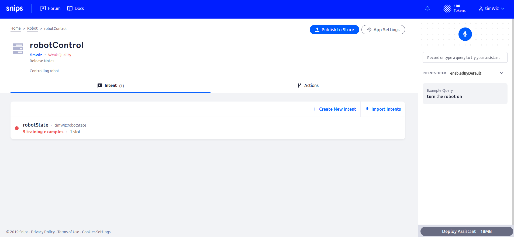

# Create a Snips Voice Assistant
Log into your account on the [Snips console](https://console.snips.ai).


Create an Assistant called `Robot`.


Create an app called `robotControl`.


Enter your app and create an intent called `robotState`.



Once you've defined your intent, you need to extract whether you want your robot `on` or `off`. This is where slots come in.

Create a new slot called `state` and a custom slot type with the same name.


Once you've clicked "Create New Slot Type", you will be directed to the screen below to enter details.


Enter values `on` and `off` with your desired synonyms. We have used `begin` and `end`.

Finally, add at least 5 training examples for how you might address the robot be turned on or off. Highlight the part of the phrase that may indicate the state and select the `state` slot in the corresponding dropdown menu.


Remember to click "Save" at the bottom right corner to save your app.

# Deploy Voice Assistant

You should have installed the SAM CLI tool on your PC as a pre-requisite. If you have not, do so now.
- Install [Node.js](https://nodejs.org) (Dependency for Sam CLI)
- Install Snips' [Sam CLI Tool](https://docs.snips.ai/getting-started/quick-start-raspberry-pi#step-3-install-the-snips-platform)
```
sudo npm install -g snips-sam
```

## On your PC’s terminal:
- Type `sam login` & enter your Snips.ai account credentials (connect account)
- Type `sam connect YOUR_PI_HOSTNAME.local` or `sam connect YOUR_PI_IP` (connect to your Pi)
- `sam status` to check if Snips services are running
- `sam watch` to check Snips logs (what voice commands it hears & its responses). Say "Hey Snips" to check the logs and see if the Snips audio server heard you

On the Snips console for your `robotState` app, click on "Deploy Assistant" on the bottom right.
> If you don't see Deploy Assistant, increase your web browser's width.


Copy the `sam install ...` line and paste it into your PC's terminal to automatically deploy the `robotControl` assistant to the Raspberry Pi.

Move on to [coding actions](voice_to_actions.md).