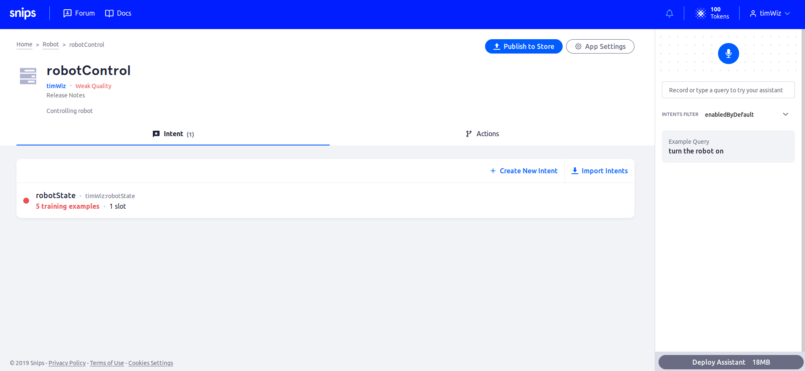

# Code Voice Commands to Actions
In the `/home/pi/matrix_lite` directory, open the file `robot.js` and edit `YOUR_SNIPS_USERNAME` to be your Snips username (on the top right of the Snips console in your broswer- `timWiz` in the image below)



`robot.js` holds the code which
- Connects to the Snips audio server hosted on your Pi
- Subscribes to MQTT messages from intents on the server
- Sets LED colors based on various cases
- Controls a servo based on IMU values if `robotState` is `on`
- Ceases control of servo based on IMU values if `robotState` is `off`
- Uses NFC tags as backup authentication for IMU-based servo control

The code provided in your RPi image is incomplete. Perform the following tasks to complete the code into the solution below.
- Set LEDs **red** when `robotState` intent is `off`
- Use UIDs of each of the provided NFC tags to toggle IMU control on or off as backup control

<details close>
<summary>
robot.js
</summary>

```js
/////////////
//VARIABLES//
/////////////
var snipsUserName = "YOUR_SNIPS_USERNAME"; // change back to YOUR_SNIPS_USERNAME
const matrix = require('@matrix-io/matrix-lite');
var mqtt = require('mqtt');
var client  = mqtt.connect('mqtt://localhost', { port: 1883 });
var wakeword = 'hermes/hotword/default/detected';
var sessionEnd = 'hermes/dialogueManager/sessionEnded';
var robotState = 'hermes/intent/'+snipsUserName+':robotState';

// IMU Variables
var IMU = require('./imu.js');
var IMUcontrol = false;

// NFC Variables
const nfc = require("@matrix-io/matrix-lite-nfc");

//////////////////////////////
// MQTT Stuff with Everloop //
//////////////////////////////

client.on('connect', function() {
	console.log("Connected to localhost");
	client.subscribe(wakeword);
    client.subscribe(sessionEnd);
    client.subscribe(robotState);
});

client.on('message', function(topic,message) {
    var message = JSON.parse(message);
	switch(topic) {
        // * On Wakeword
        case wakeword:
            console.log('Wakeword Detected');
            matrix.led.set("rgb(0,0,10)");	//set LEDs blue
        break;
        // * On Conversation End
        case sessionEnd:
            console.log('Session Ended\n');
            matrix.led.set("black");    //set LEDs black
        break;
        // * On Robot State Trigger
        case robotState:
            try{
                if (message.slots[0].rawValue === 'on'){
                    matrix.led.set("green");
                    console.log('Robot On');

                    ///////////////////////////////////////////////
                    // * Control robot servo based on IMU values //
                    ///////////////////////////////////////////////
                    IMU.controlServo(true);
                    IMUcontrol = true;
                }
                else if(message.slots[0].rawValue === 'off'){
                    
                    /////////////////////////
                    // * Set LEDs Red Here //
                    /////////////////////////

                    IMU.controlServo(false);
                    IMUcontrol = true;

                    console.log('Robot Off');
                }
            }
            catch(e) {
                matrix.led.set("orange");
                console.log('Did not receive an On/Off state');
            }
        break;        
    }
});

///////////////////////////////////////
// * Add case for NFC Backup Control //
///////////////////////////////////////
var ON_TAG_UID = "YOUR_ON_TAG_UID";
var OFF_TAG_UID = "YOUR_OFF_TAG_UID";

nfc.read.start({rate:250, info:true}, (code, tag)=>{
    if (code === 256){
        if (IMUcontrol === false && tag.info.UID === ON_TAG_UID) {
            IMU.controlServo(true);
            IMUcontrol = true;
        } else if (IMUcontrol === true && tag.info.UID === OFF_TAG_UID) {
            IMU.controlServo(false);
            IMUcontrol = false;
        }
    }
    else if (code === 1024) {

    }
});
```
</details>

Look into the file `imu.js` to see how the `pitch` of the MATRIX Creator determines servo motor position.

<details close>
<summary>
imu.js
</summary>

```js
const matrix = require('@matrix-io/matrix-lite');
var methods = {};// Declaration of method controls at the end
var servoPin = 0;// The GPIO pin connected to your servo motor

function setServo(servoAngle){
    matrix.gpio.setFunction(servoPin, 'PWM');
    matrix.gpio.setMode(servoPin, 'output');

    matrix.gpio.setServoAngle({
        pin: servoPin,
        angle: servoAngle,
        // minimum pulse width for a PWM wave (in milliseconds)
        min_pulse_ms: 0.8
    });
}

//////////////////////////////////////////////////
// scaling function: map range to another range //
//////////////////////////////////////////////////
const scale = (num, in_min, in_max, out_min, out_max) => {
    if (num < in_min) {
      num = in_min;
    } else if (num > in_max) {
      num = in_max;
    }
    return (num - in_min) * (out_max - out_min) / (in_max - in_min) + out_min;
  }
//////////////////////////
// end scaling function //
//////////////////////////


////////////////////////
// IMU Control Method //
////////////////////////
var intervalID = 0;
methods.controlServo = function(flag) {
    if (flag) {
        intervalID = setInterval(function(){
            var servoAngle = scale(matrix.imu.read().pitch, -80, 80, 10, 170);
            setServo(servoAngle);
            console.log(servoAngle);
        }, 100);
        console.log("IMU controlling servo");
    } else {
        clearInterval(intervalID);
        console.log("stopping IMU control");
    }
};

module.exports = methods;// Export methods in order to make them avaialble to other files

```
</details>

Move on to [bonus challenge](im_bored_challenge.md).